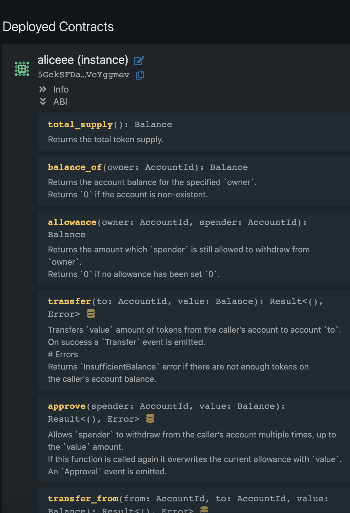
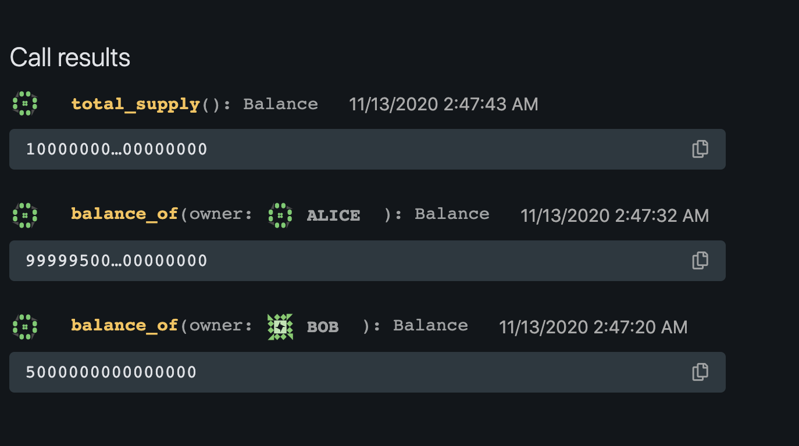
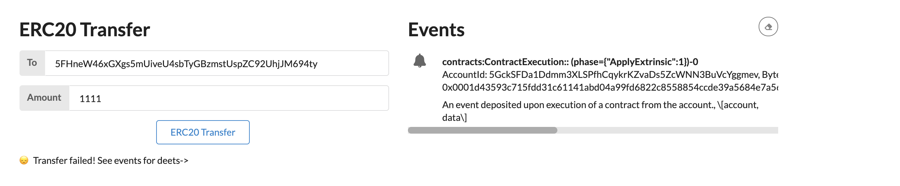

# polkadot-hackathon

### [INTERMEDIATE CHALLENGE] Smart Contracts - Write An ERC-20 Smart Contract With Ink!

First we deploy contract on Canvas:

Then we can call the `transfer` method to transfer from `Alice` to `Bob`, lets check the balance by Canvas:

Then we try to transfer ERC20 by UI:

Lets check the balance again on Canvas:

